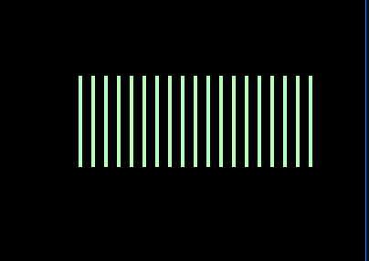

# Sticks Loser Game

The loser is the one who takes the last wand. You can take only an odd number of sticks.
The program is written in 13h mode.

Requirements:
- Support for 16-bit applications;
- FASM; 
- Macro proc16.inc: http://asmworld.ru/content/filez/tools/PROC16.zip
